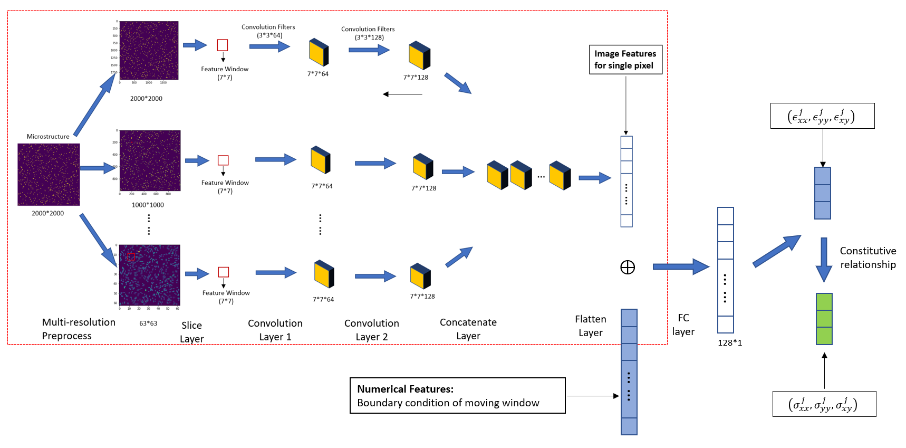
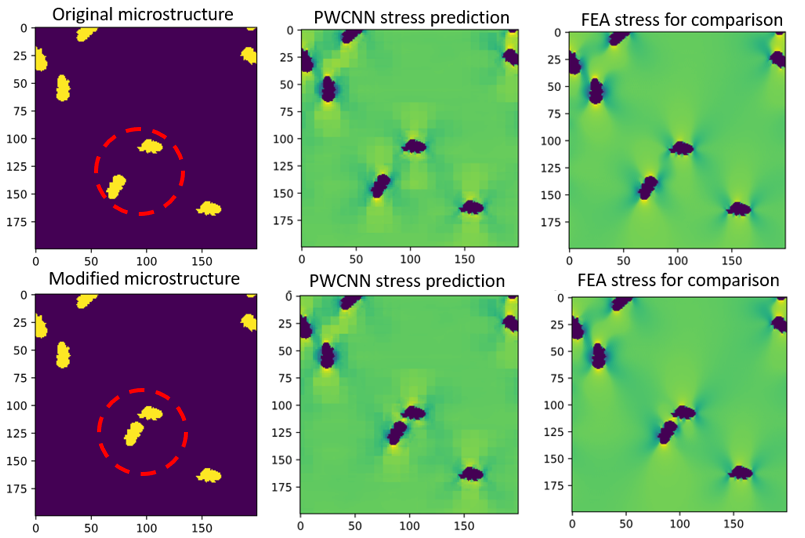

# PWCNN
Data and codes for the paper: "Fast, Interpretable Prediction of Local Properties for Composite Materials"

The Pixel-Wise CNN (PWCNN) is a customized CNN model and is designed for the stress/strain field predictions on composite material microstructures. Its architecture is depicted as follows. 

The Interpretable Machine Learning (IML) framework established in the paper facilitates the scientific discovery of why certain microstructures have better or worse performance than others, which have immense potential in design of composites' microstructure through advanced manufacturing. An example of the IML framework is:

# Licence
This project is licensed under the Apache License - see the [LICENSE](LICENSE) file for details
